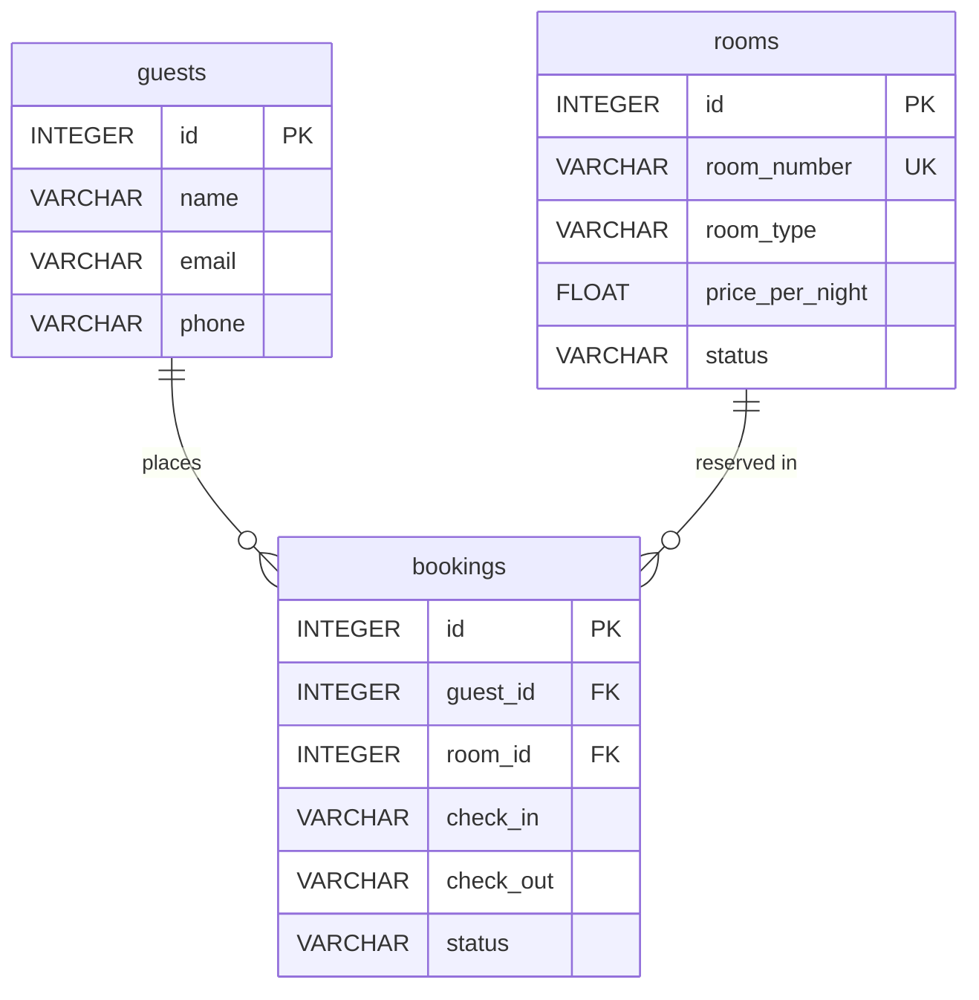

# Database Schema

This document details the database schema and entity relationships for the **Hotel Management Agent**, derived directly from the SQLite database (`hotel.db`) and SQLAlchemy models (`app/models.py`).

---

## Entity-Relationship (ER) Diagram

---

## Tables and Columns

### 1. `guests`

Stores guest profile information and contact details.

| Column | Type | Constraints | Description |
| :--- | :--- | :--- | :--- |
| `id` | INTEGER | PRIMARY KEY, INDEX | Unique guest identifier |
| `name` | VARCHAR | NOT NULL, INDEX | Full name of the guest |
| `email` | VARCHAR | NULLABLE | Contact email address |
| `phone` | VARCHAR | NULLABLE | Contact phone number |

- **Primary Key**: `id`
- **Indexes**: `ix_guests_id`, `ix_guests_name`
- **Foreign Keys**: None
- **Relationships**: One-to-Many (`1:N`) with `bookings` (`cascade="all, delete-orphan"`)

---

### 2. `rooms`

Stores hotel room inventory, classification, pricing, and operational status.

| Column | Type | Constraints | Description |
| :--- | :--- | :--- | :--- |
| `id` | INTEGER | PRIMARY KEY, INDEX | Unique room identifier |
| `room_number` | VARCHAR | NOT NULL, UNIQUE, INDEX | Room number (e.g., `"101"`, `"201"`) |
| `room_type` | VARCHAR | NOT NULL, INDEX | Room category (`"Single"`, `"Double"`, `"Deluxe"`) |
| `price_per_night` | FLOAT | NOT NULL | Price per night in USD |
| `status` | VARCHAR | NOT NULL, DEFAULT `'available'` | Operational status (`"available"`, `"occupied"`, `"maintenance"`) |

- **Primary Key**: `id`
- **Indexes**: `ix_rooms_id`, `ix_rooms_room_number` (UNIQUE), `ix_rooms_room_type`
- **Foreign Keys**: None
- **Relationships**: One-to-Many (`1:N`) with `bookings`

---

### 3. `bookings`

Stores room reservation records linking guests to rooms across specific date ranges.

| Column | Type | Constraints | Description |
| :--- | :--- | :--- | :--- |
| `id` | INTEGER | PRIMARY KEY, INDEX | Unique booking identifier |
| `guest_id` | INTEGER | NOT NULL, FK (`guests.id`) | Foreign key referencing `guests(id)` |
| `room_id` | INTEGER | NOT NULL, FK (`rooms.id`) | Foreign key referencing `rooms(id)` |
| `check_in` | VARCHAR | NOT NULL | Reservation start date (`YYYY-MM-DD`) |
| `check_out` | VARCHAR | NOT NULL | Reservation end date (`YYYY-MM-DD`) |
| `status` | VARCHAR | NOT NULL, DEFAULT `'confirmed'` | Booking state (`"confirmed"`, `"cancelled"`) |

- **Primary Key**: `id`
- **Indexes**: `ix_bookings_id`
- **Foreign Keys**:
  - `guest_id` REFERENCES `guests(id)`
  - `room_id` REFERENCES `rooms(id)`
- **Relationships**:
  - Many-to-One (`N:1`) with `guests`
  - Many-to-One (`N:1`) with `rooms`

---

## Relationships & Integrity Rules

1. **Guest to Bookings (1:N)**:
   - A single guest can hold multiple bookings over time.
   - Deleting a guest cascades deletion to associated bookings (`cascade="all, delete-orphan"`).
2. **Room to Bookings (1:N)**:
   - A single room can be reserved across multiple distinct booking intervals.
   - The application checks for overlapping confirmed date intervals prior to booking creation.
3. **Room Availability Status**:
   - Rooms can be flagged as `"available"`, `"occupied"`, or `"maintenance"`.
   - Tool functions dynamically compute room availability by checking both the room operational status and date overlap against confirmed bookings.

---

## Seed Data

On initial startup (`init_db()`), the database automatically initializes with:
- **6 Rooms**: 101 (Single, $50), 102 (Single, $50), 201 (Double, $80), 202 (Double, $80), 301 (Deluxe, $150), 302 (Deluxe, $150).
- **3 Guests**: John Doe, Alice Smith, Robert Johnson.
- **1 Active Booking**: Room 201 for John Doe (confirmed).
