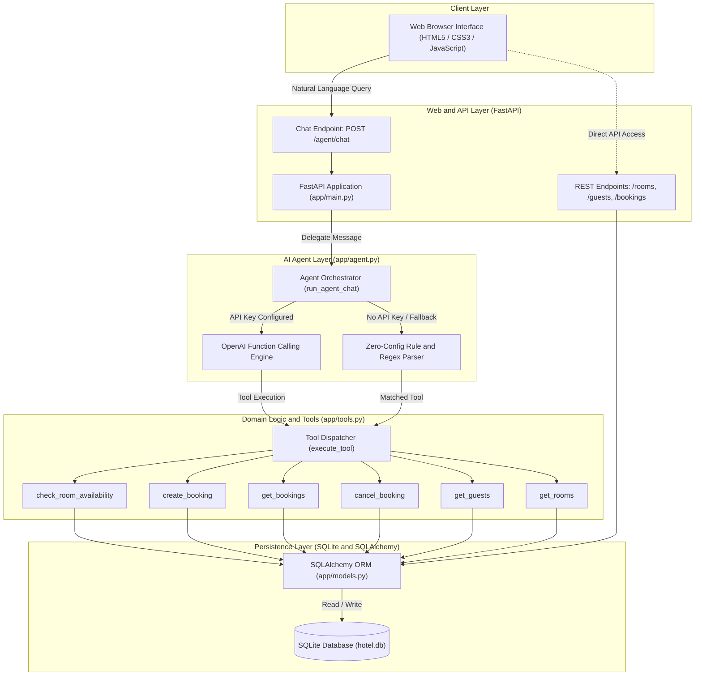
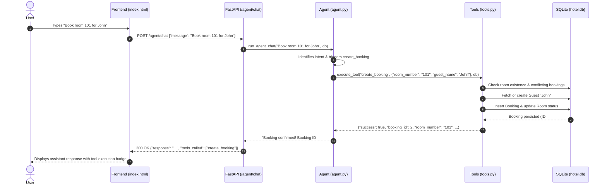

# System Architecture - Hotel Management Agent

This document details the system architecture, component interactions, and data flow for the **Hotel Management Agent**.

---

## 1. System Architecture Diagram

---

## 2. Component Explanation

### 1. Client Layer (`app/static/`)
- **Technology**: Vanilla HTML5, modern CSS3, and native JavaScript.
- **Role**: Lightweight chat interface providing a single-page view. Users send natural language queries (e.g., *"Show available rooms"*, *"Book room 101 for John"*) or click suggested prompt chips. Displays real-time responses and visual badges indicating which backend tools were invoked.

### 2. Web & API Layer (`app/main.py`, `app/routes/`)
- **Technology**: Python 3.12+, FastAPI, Uvicorn, Pydantic v2.
- **Role**:
  - Hosts the HTTP server, CORS middleware, and static asset mount.
  - Exposes the conversational agent endpoint: `POST /agent/chat`.
  - Exposes standard REST endpoints for programmatic operations:
    - `GET /rooms`: List and filter rooms by type and status.
    - `GET /guests`: Search and list registered guests.
    - `GET /bookings`: Query all bookings with optional status filters.
    - `POST /bookings`: Create a new reservation directly.
    - `DELETE /bookings/{id}`: Cancel a reservation by ID.

### 3. AI Agent Layer (`app/agent.py`)
- **Technology**: OpenAI-compatible function-calling client with rule-based fallback.
- **Role**:
  - Injects runtime context (such as the current system date) and tool definitions into the conversation.
  - **LLM Function-Calling Engine**: When an `OPENAI_API_KEY` is provided, drives an autonomous iterative tool-calling loop (up to 4 iterations) that translates user intent into concrete tool invocations.
  - **Zero-Config Fallback Engine**: If no API key is configured or an API error occurs, an intelligent pattern-matching engine handles availability checks, bookings, cancellations, and queries locally.

### 4. Domain Logic & Tools (`app/tools.py`)
- **Role**: Contains the business logic of hotel operations exposed as structured tools:
  1. `check_room_availability`: Identifies open rooms, filtering by room type and checking for date overlap against existing reservations.
  2. `create_booking`: Creates a guest profile if necessary, checks for date conflicts, reserves the room, and sets room occupancy.
  3. `get_bookings`: Retrieves active, historical, or today-only bookings.
  4. `cancel_booking`: Cancels a reservation and resets room availability if no other active reservations exist for today.
  5. `get_guests`: Looks up guest contact profiles.
  6. `get_rooms`: Returns full room inventory with pricing and operational states.
  - `execute_tool`: Central dispatcher routing function calls from either the LLM or the fallback engine to the corresponding Python function.

### 5. Persistence Layer (`app/database.py`, `app/models.py`)
- **Technology**: SQLite (`hotel.db`), SQLAlchemy 2.0 ORM.
- **Role**:
  - Manages database connection pooling (`engine`), session lifecycle (`SessionLocal`, `get_db`), and schema migration (`init_db()`).
  - Maintains 3 relational tables: `guests`, `rooms`, and `bookings` with indexed primary keys, foreign key constraints, and cascade delete behavior.
  - Details of tables and ER diagrams are provided in [database-schema.md](database-schema.md).

---

## 3. End-to-End Workflow: Booking a Room

